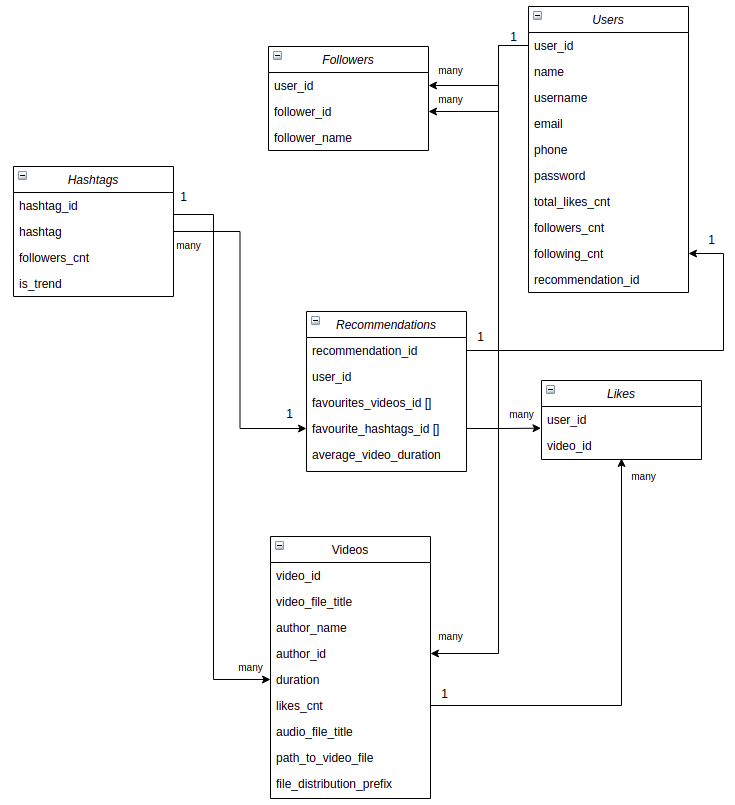

# HighLoad

The project was developed as part of the Technopark's high-load systems course.

---

### 1. Тема проекта:

Социальная сеть - TikTok.

#### Целевая аудитория сервиса:

- Российская аудитория ~ [23.1 млн](https://www.businessofapps.com/data/tik-tok-statistics/#5)

#### MVP проекта:

1. Авторизация, регистрация, профиль пользователя;
2. Просмотр видео;
3. Поиск.

### 2. Расчет нагрузки (Россия):

#### Исходные данные ([Источник](https://news.cpa.ru/tiktok-showed-audience-statistics/)):

- Среднее время, которое проводит пользователь в приложении за день: 45 мин;
- Среднее число заходов в приложение за день: 6-7;
- Максимальная длина ролика: 1 минута;
- Минимальная длина ролика: 15 секунд;
- Максимальный размер видео: 75Mb (android), 250Mb (ios);
- 73% используют Android-устройства, а 27% – посещают сервис с iOS;
- Количество лайков видео за день: [54 млн](https://news.cpa.ru/tiktok-showed-audience-statistics/)  
- Число ежедневных просмотров видео: [666 млн](https://news.cpa.ru/tiktok-showed-audience-statistics/);
- Число ежедневных загрузок видео: [666 тыс](https://news.cpa.ru/tiktok-showed-audience-statistics/);
- Активная аудитория России: [18 млн человек](https://news.cpa.ru/tiktok-showed-audience-statistics/);
- Среднее число [хэштегов в видео: 4](https://rusability.ru/articles/Heshtegi-dlya-Tik-Tok-kak-podobrat,-ispolzovat-i-prodvigatsya-bistree-konkurentov/5fd296ad2dda593c3483efc4);
#### Расчеты:

- Средняя длина ролика ~ 30 сек;
- Средний объем выгружаемого на сервер видеоконтента: 75 * 0.73 + 250 * 0.27 = 122.25 мб;  
- Дневная аудитория в среднем составляет около ~41% от активной аудитории: 0.41 * 18 * 10 ^ 6 = 7.4 млн;
- Среднее число просмотренных видео за день: 45 мин / 0.5 мин = 90 видео;
- Средний объем видео трафика с сервера для одного
  пользователя: [16 Mb/min](https://www.quora.com/What-uses-more-data-watching-YouTube-videos-for-an-hour-or-TikTok-videos-for-an-hour);
- Средний битрейт видео, загружаемого на сервер, с учетом максимальной продолжительности видео в 60 секунд и его среднего
  объема в 122.25 мб: 122.25 / 60 ~ 16.3 Мбит / сек;
  
Каждое новое видео требует запроса не только к видеофайлу, но и запроса 
бизнес-логики, который позволит получить число лайков, комментариев, подписчиков и прочие вспомогательные данные.
Будем считать, что информация, сопутствующая видео занимает
15% от объема переданного с сервера видеоконтента, то есть 0.15 * 16 = 2.4 Mb / min.

Так как при загрузке контента сначала появляется информация о видео, то пусть при загрузке одного видео будут 
осуществляться еще 2 запроса бизнес-логики на:
- получение информации о видео (название видео, название аудио, хэштеги, дата, число лайков, число комментариев)
- информация об авторе (никнейм, аватар)

Также в среднем каждые 10 свайпов видео вызывают 1 запрос на получение рекомендаций для пользователя в виде следующих
10 видео. 

Тогда для одного пользователя за 45 минут в среднем осуществляется:
- запросов за видео-контентом: 90;
- запросов бизнес-логики: 2 * 90 + 90/10 = 189;
- запросов на выгрузку видеоконтента: 666 000 / 7.4 * 10 ^ 6 = 0.09

Нагрузка для одного пользователя в секунду | Сеть 
--- | ---
Загрузка видеоконтента | 16 * 8 / 60  = **2.13** Мбит / с
Публикация видеоконтента | (666 000 / (24 * 3600)) / (7.4 * 10 ^ 6 / (24 * 3600)) * 16.3 = **1.3** Мбит / с 
Бизнес-логика | 2.4 * 8/ 60 = **0.32** Мбит / с

Нагрузка дневной аудитории | Сеть 
--- | ---
Загрузка видеоконтента | 2.13 * 60 * 45 * (7.4 * 10 ^ 6 / (24 * 3600)) = **0.47** Тбит / c
Публикация видеоконтента | 1.3 * 60 * 45 * (7.4 * 10 ^ 6 / (24 * 3600)) = **0.29** Тбит / c
Бизнес-логика | 0.32 * 60 * 45 * (7.4 * 10 ^ 6 / (24 * 3600))  = **0.07** Тбит / c 

Тип запроса | RPS средний | RPS пиковый (50 % дневной аудитории)
--- | --- | ---
Загрузка видеоконтента | 90 * (7.4 * 10 ^ 6 / (24 * 3600 * 30)) ~= **257** | 90 * (0.5 * 7.4 * 10 ^ 6 / (45 * 60 * 30)) ~= **8222**
Публикация видеоконтента | 0.09 * (7.4 * 10 ^ 6 / (24 * 3600)) ~= **8** | 0.09 * (0.5 *7.4 * 10 ^ 6 / (45 * 60)) ~= **123**
Бизнес-логика | 257 * 2 + 257 / 10 ~= **540** | 8222 * 2 + 8222/10 ~= **17266**

Тогда, учитывая, что одно ядро процессора может отдать ~50rps, нам понадобится 11 серверов с 32 ядрами каждый.

### 3. Логическая схема БД:

---

### 4. Физическая схема БД:

Так как нагрузка на бизнес-логику и бд в среднем небольшая, то архитектура системы будет **монолитной**. Видео-контент будет
храниться на **CDN-серверах**, так как запросы за видео популярные и при этом тяжелые. Запросы за бизнес-логикой будут 
равномерно распределены между одиннадцатью бэкендами для обеспечения отказоустойчивости. А запросы за видео будут проксироваться на CDN-сервера. Загрузка видео на
CDN-сервера, при чем одновременно с сохранением в бд основной информации о видео (см. логическую схему)

#### Расчет таблиц БД
Размер uuid - 16 bytes.

    videos:
      video_id(16) + title(150) + author_name(24) + autor_id(16) + duration(4) + likes_cnt(8) + audio_file_title(50) + path_to_video_file(128) + file_prefix(16) = 412 bytes
      
    Количество загружаемых видео: 20 * 10^6 / month, на первый год потребуется 12 * 20 * 10^6 * 412 ~ 92.1 Gb для хранения в бд 
    и так как средняя длина видео равна 30 секундам, то средний объём одного видео равен 30 * 16.3 / 8 = 61 мб. 
    Тогда в месяц суммарный объем: 20 * 10^6 * 61 = 1163 Тб.
    
    users:
      user_id(16) + name(20) + username(24) + email(128) + phone(11) + password(128) + total_likes_cnt(8) + followers_cnt(8) + following_cnt(8) + recommendation_id(16) = 367 bytes
      Количество пользователей в России: 23.1 * 10^6, потребуется 23.1 * 10^6 * 367 ~ 7.9 Gb
    
    followers:
      follower_id(16) + user_id(16) + follower_name(24) = 56 bytes
      Будем считать только Российский сегмент без подписок на иностранных авторов: 
      потребуется 23.1 * 10^6 * 56 ~ 1.2 Gb
    
    hashtags:
      hashtag_id(16) + hashtag(100) + followers_cnt(8) + is_trend(1) ~ 125 bytes
      В среднем для видео генерируется 4 хэштега. Для Российского сегмента потребуется:
      12 * 20 * 4 * 10^6 * 125 ~ 111 Gb

    recommendations:
      Предположим, рекомендации пользователя определяются на основании 10 последних просмотренных видео и 5 наиболее популярных хэштегов.
      recommendation_id(16) + user_id(16) + favourites_videos_id(16 * 10) +  favourites_hashtags_id(16 * 5) + average_video_duration(4) = 356 bytes
      23.1 * 10^6 * 356 ~ 7.66 Gb

    likes:
      user_id + like_id = 32 bytes
      За 1 день проставляется около 54 млн лайков, тогда на год потребуется: 32 * 54 * 10^6 * 30 * 12  ~ 580 Gb 

|Сущность|Объем памяти на первый год работы|
| -------------  | :-------------:  |
|Users|7.9 Гб|
|Recommendations|7.66 Гб|
|Videos|92.1 Гб / 13.63 Пб|
|Hashtags|111 Гб|
|Followers|1.2 Гб|
|Likes|580 Гб|

Для успешной доставки видеоконтента пользователям, CDN необходимо спроектировать так, чтобы ее сервера были в равной степени нагружены
и примерно равноудалены от пользователей в разных частях страны. Делая поправку на распределение населения по площади страны, CDN-сервера 
следует расположить вблизи городов-миллионников преимущественно западной части страны.

#### Выгрузка контента на CDN-сервера

При DNS-запросе пользователь получает адрес ближайшего к нему узла, это будет происходить, так как будет настроен 
[geo based dns](https://docs.microsoft.com/ru-ru/windows-server/networking/dns/deploy/primary-geo-location).
В случае, если запрашиваемый контент является популярным, то он закэширован и хранится
на CDN-серверах, если нет, то будет осуществляться запрос непосредственно в файловое хранилище, но таких запросов будет 
сравнительно меньше, так как лента рекомендаций подбирается на основании собранной статистики пользователя из популярного
контента.
Выгрузка видео на CDN-сервера будет осуществляться через сторонний сервис, который через backend будет в ночное время
запрашивать статистику о наиболее популярных видео из реляционной БД. После того как сервис загрузки контента проанализирует статистику,
будет осуществляться удаление устаревшего контента из хранилищ CDN-серверов и размещение нового популярного на всех узлах.

#### Конфигурация CDN-серверов
- При пиковом онлайне (50% дневной аудитории) общая пропускная способность: 0.5 * 7.4 * 10 ^ 6 * 3.75 ~= **13.23 Тбит / сек**
- С использованием трех сетевых карт на 25 Гбит / сек потребуется 13548 / (25 * 3) ~= **109 серверов**
- С учетом того, что в месяц суммарный объем видеоконтента составляет 1163 тб, а также предполагая, что в тренд попадает 15%
  от всего загруженного контента и период его нахождения в топе составляет 5 дней, получаем объем ssd: 1163 * 0.15 / 30 * 3 ~= **32 тб**
- Контент, не попавший в топ или уже вышедший из него будет суммарно занимать на hdd: 13.6 Пб
- Для организации горизонтального масштабирования файлового хранилища будут использоваться технология объединения физических дисков 
  в логический том [RAID](https://altastor.ru/tech/raid/):
  для ssd будет использован тип RAID-5, так как обеспечивает среднюю надежность (допустим выход из строя 1 диска) и при этом
  обладает высокой эффективностью чтения. Число и объем дисков определяется как (n-1)*3.84тб = 32 тб => **10 ssd емкостью 3.84 тб**
  для hdd будет использован тип RAID-6, так как обладает достаточной надежностью (допустим выход из строя 2 дисков) и 
  допустима низкая производительности на запись, так как частота операций записи невысокая.
 Число и объем дисков определяется как (n-2)*4тб = 14000 тб => **3500 hdd емкостью 4 тб** Их необходимо будет разместить
  на 44 дополнительных серверах с RAID-6 типом объединения по 20 hdd на сервер.
  
#### Выбор СУБД

Данные пользователей, информацию о видео, подписках и рекомендациях будут храниться в PostgreSQL, как в хорошо
зарекомендовавшей себя реляционной БД, которая поддерживает все необходимые средства для организации распределенных
систем. 

### 5. Выбор технологий

- Бэкенд будет реализован с использованием языка golang, который довольно легок в освоении и из коробки уже содержит
необходимый функционал для поточной обработки соединений.
- Фронтенд будет написан на React+Mobx+Typescript и будет реализовывать функционал SPA. Сборка будет реализовываться с использованием
webpack. 
  
### 6. Схема проекта

#### Выбор оборудования

| Сервер                    | CPU  | RAM   | Диск                  | Кол-во     | Местоположение
|---                        |---   |---    |---                    |---         |---
|Бэкенд                     |32    | 256 | 32Гб х 1SSD             | 11+6       |Москва   
|Фронтенд                   |16    | 256 | 32Гб х 1SSD             | 10         |Москва    
|Postgresql                 |32    | 512 | 1Тб х 1SSD              | 1+2        |Москва 
|Nginx                      |32    | 256 | 16Гб х 1SSD             | 20         |Москва
|Сервис рекомендаций        |8     | 256 | 32Гб х 1SSD             | 10         |Москва
|Сервис загрузки контента   |8     | 128 | 32Гб х 1SSD             | 10         |50 % - Москва и 50 % - остальные крупные города России
|Сервера CDN                |8     | 64  | 64Гб х 1SSD             | 110        |50 % - Москва и 50 % - остальные крупные города России
|Файловые сервера           |8     | 64  | 4Тб х 20HDD             | 44         |50 % - Москва и 50 % - остальные крупные города России

#### Схема проекта

